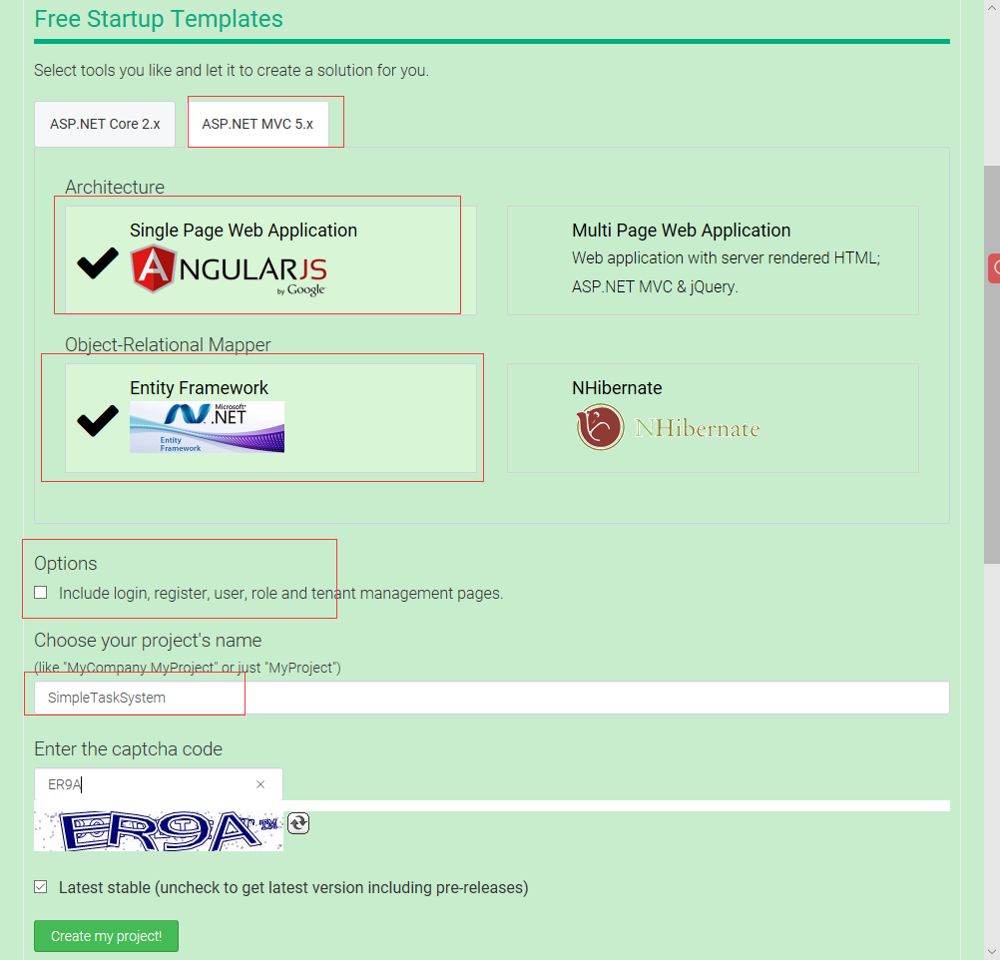
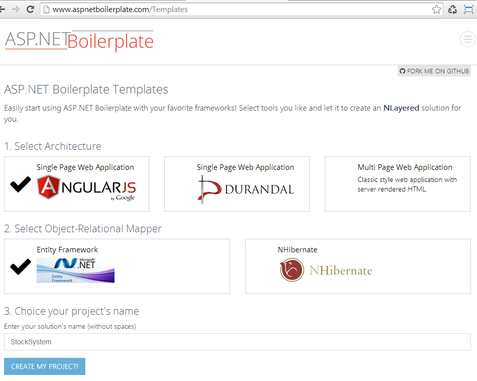
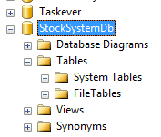
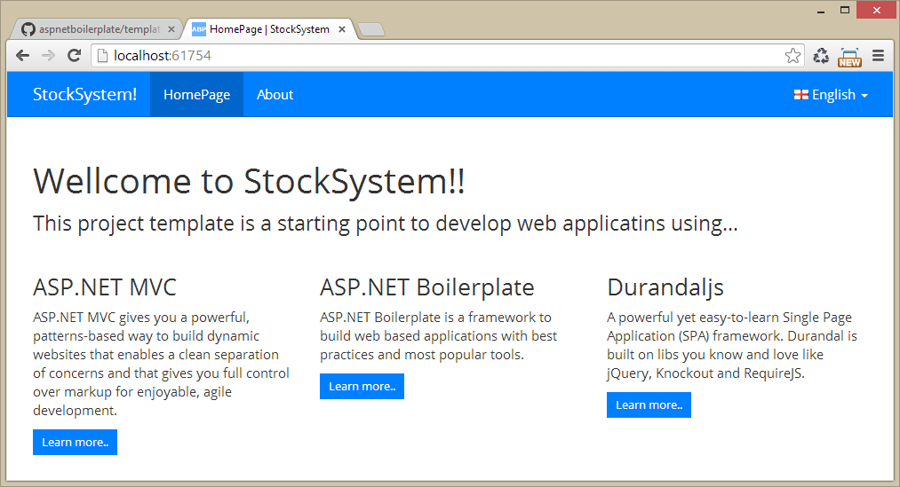

# Albert.SimpleTaskApp.AngularJS

#### AspNet MVC Web API EntityFramework and AngularJS

参考[ABP官网](https://aspnetboilerplate.com/)提供的[教程](https://aspnetboilerplate.com/Pages/Documents/Articles/Introduction-With-AspNet-MVC-Web-API-EntityFramework-and-AngularJs/index.html)。展示了从头到尾创建一个单页面web应用(SPA)，使用到下面的工具：
* ASP.NET MVC 和 ASP.NET Web API 作为Web框架.
* AngularJS 作为SPA框架
* EntityFramework作为ORM框架
* Castle Windsor作为依赖注入框架
* Twitter Bootstrap 作为 HTML/CSS 框架
* Log4Net 日志, AutoMapper 对象映射.
* ASP.NET Boilerplate 作为应用的启动模板框架

# ASP.NET Boilerplate Templates

This document explains preparing a running Web Application from ASP.NET Boilerplate templates in 3 simple steps.

#### Step 1

Go to http://www.aspnetboilerplate.com/Templates, select your architecture and ORM framework, enter a solution name and create your project.

A zip file will be created and downloaded automatically for you.

#### Step 2

To be able to run the application, you need to create an empty database in SQL Server. Database's name in your solution's name plus 'Db' suffix:

#### Step 3

Open your solution in Visual Studio and run it:

That's it! Your solution is ready and running.

What's next? Read documentation on http://www.aspnetboilerplate.com/Pages/Documents