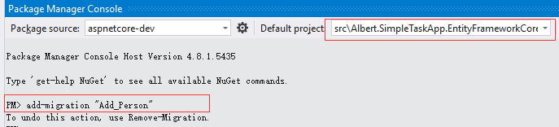
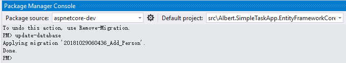
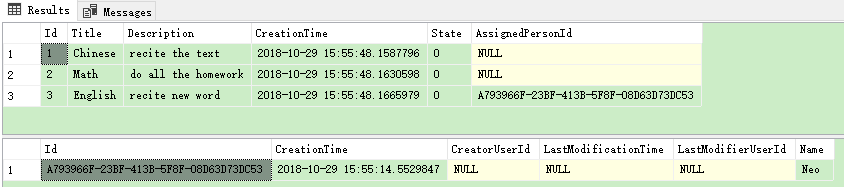
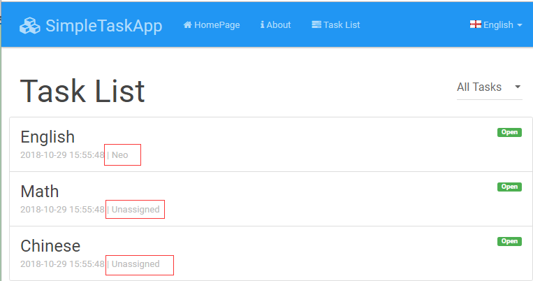

#### 创建Person实体

这里将Person的概念添加到应用中，并分配任务给人。先定义一个简单的Person实体：
```csharp
[Table("AppPersons")]
public class Person : AuditedEntity<Guid>
{
    [Required]
    [StringLength(SimpleTaskAppConsts.MaxNameLength)]
    public string Name { get; set; }

    public Person() { }

    public Person(string name)
    {
        Name = name;
    }
}
```
这次为了演示，设置Id(主键)类型为Guid。实体继承AuditedEntity(包含了：CreationTime, CreaterUserId, LastModificationTime 和 LastModifierUserId 属性)。

#### 关联Person和Task实体

在Task实体添加AssignedPerson 属性(只列出改变的部分)：
```csharp
/// <summary>
/// 任务
/// </summary>
[Table("AppTasks")]
public class Task : Entity, IHasCreationTime
{
    //................

    [ForeignKey(nameof(AssignedPersonId))]
    public Person AssignedPerson { get; set; }
    public Guid? AssignedPersonId { get; set; }


    public Task(string title, string description = null, Guid?assignedPersonId = null) : this()
    {
        Title = title;
        Description = description;
        AssignedPersonId = assignedPersonId;
    }
}
```
AssignedPerson是可选的。这样任务可以分配给一个人，也可以不分配。

#### 添加Person到DbContext

最后添加新的Person实体到DbContext类：
```csharp
public class SimpleTaskAppDbContext : AbpDbContext
{
    //Add DbSet properties for your entities...
    //...
    public DbSet<Person> People { get; set; }
    //...
}
```

#### 针对Person添加新的数据迁移

在Package Manager Console运行命令：add-migration "Add_Person"



运行命令成功，在.EntityFrameworkCore项目中生成新的迁移类：
```csharp
public partial class Add_Person : Migration
{
    protected override void Up(MigrationBuildermigrationBuilder)
    {
        migrationBuilder.AddColumn<Guid>(
            name: "AssignedPersonId",
            table: "AppTasks",
            nullable: true);

        migrationBuilder.CreateTable(
            name: "AppPersons",
            columns: table => new
            {
                Id = table.Column<Guid>(nullable: false),
                CreationTime = table.Column<DateTime>(nullable false),
                CreatorUserId = table.Column<long>(nullable:true),
                LastModificationTime = table.Column<DateTime(nullable: true),
                LastModifierUserId = table.Column<long(nullable: true),
                Name = table.Column<string>(maxLength: 32,nullable: false)
            },
            constraints: table =>
            {
                table.PrimaryKey("PK_AppPersons", x => x.Id);
            });

        migrationBuilder.CreateIndex(
            name: "IX_AppTasks_AssignedPersonId",
            table: "AppTasks",
            column: "AssignedPersonId");

        migrationBuilder.AddForeignKey(
            name: "FK_AppTasks_AppPersons_AssignedPersonId",
            table: "AppTasks",
            column: "AssignedPersonId",
            principalTable: "AppPersons",
            principalColumn: "Id",
            onDelete: ReferentialAction.Restrict);
    }

    //...
}
```
注意到上面的代码中的：
```
onDelete: ReferentialAction.Restrict
```
这里手动修改为:
```
onDelete: ReferentialAction.SetNull
```
修改的作用：当删除一个Person对象时，分配给这个对象的任务变成未分配状态，这一点在这个demo中是不重要的，只是为了说明在需要的时候可以修改迁移代码。实际中，在将其应用到数据库之前都先检查生成的迁移代码。之后再应用迁移到数据库：



向前面的Task一样，这里还是通过Seed的方式向数据库添加初始数据，添加类InitialPerson创建初始数据：
```csharp
public class InitialPerson
{
    private readonly SimpleTaskAppDbContext dbContext;

    public InitialPerson(SimpleTaskAppDbContext dbContext)
    {
        this.dbContext = dbContext;
    }

    public void Create()
    {
        CreatePeople();
    }

    private void CreatePeople()
    {
        if(dbContext.People.Any())
        {
            return;
        }
        
        dbContext.Add(new Person("Neo"));
        dbContext.SaveChanges();
    }
}
```
在SeedHelper中调用InitialPerson：
```csharp
private static void SeedDb(SimpleTaskAppDbContext context)
{
    new InitialPerson(context).Create();
    new InitialTask(context).Create();
}
```
需要注意的时people的创建需要在task之前，同时修改task的seed数据初始化方法：
```csharp
private void CreateTask()
{
    var neo = context.People.FirstOrDefault();
    if (context.Tasks.Any())
    {
        if (context.Tasks.All(t => t.AssignedPersonId == null))
        {
            context.Tasks.Last().AssignedPersonId = neo.Id;
            context.SaveChanges();
        }
        
        return;
    }

    context.AddRange(
        new Task { Title = "Chinese", Description = "recite the text" },
        new Task { Title = "Math", Description = "do all the homework" },
        new Task { Title = "English", Description = "recite new word", AssignedPersonId =neo?.Id }
        );

    context.SaveChanges();
}
```
在初始化task数据中添加了AssignedPerson的id，如果按照教程先进行了task数据的seed，到这里在添加people的数据就在前面的if语句中进行更新，如果下载源代码直接迁移就在下面的AddRange方法中添加。启动程序可以在数据库中查看添加的数据：



#### 在返回Task列表中添加分配的Person

修改TaskAppService 来返回分配的人员信息，首先在TaskListDto中添加两个属性：
```csharp
[AutoMapFrom(typeof(Task))]
public class TaskListDto : EntityDto, IHasCreationTime
{
    public Guid? AssignedPersonId { get; set; }
    public string AssignedPersonName { get; set; }
}
```
在查询中通过**Include**方法(.Include(t => t.AssignedPerson))添加Task.AssignedPerson属性：
```csharp
public async Task<ListResultDto<TaskListDto>> GetAll(GetAllTasksInput input)
{
    var tasks = await repository.GetAll()
        .Include(t => t.AssignedPerson)
        .WhereIf(input.State.HasValue, t => t.State ==input.State)
        .OrderByDescending(t => t.CreationTime)
        .ToListAsync();

    return new ListResultDto<TaskListDto(ObjectMapper.Map<List<TaskListDto>>(tasks));
}
```
这样，GetAll方法将随tasks一并返回分配人员的信息。通过AutoMapper，新属性自动复制到Dto对象。

#### 修改单元测试测试分配人员

这里修改单元测试查看在获取task列表时分配人员是否一并返回。首先，修改`TestDataBuilder`中的初始化测试数据，分配一个人员给task：
```csharp
public void Build()
{
    //create test data here...
    var neo = new Person("Neo");
    _context.People.Add(neo);
    _context.SaveChanges();

    _context.Tasks.AddRange(
        new Task("Follow the white rabbit", "Follow thewhite rabbit in order to know thereality.",neo.Id),
        new Task("Clean your room") { State =TaskState.Completed }
        );
}
```

然后，修改TaskAppService_Tests.Should_Get_All_Tasks方法来检查返回的任务中是否有一个具有分配人员信息：
```csharp
[Fact]
public async System.Threading.Tasks.TaskShould_Get_All_Tasks()
{
    //Act
    var output = await taskAppService.GetAll(newGetAllTasksInput());

    //Assert
    output.Items.Count.ShouldBe(2);
    output.Items.Count(t => t.AssignedPersonName !=null).ShouldBe(1);
}
```
编译，运行单元测试通过。

**注意：** **Count**扩展方法需要 *using System.Linq;* 声明。

#### 在任务列表页面显示分配人员

修改Tasks\Index.cshtml来显示AssignedPersonName：
```html
@foreach (var task in Model.Tasks)
{
    <li class="list-group-item">
        <span class="pull-right label@Model.GetTaskLabel(task)">@L($"TaskState{task.State}")</span>
        <h4 class="list-group-itemheading">@task.Title</h4>
        <div class="list-group-item-text">
            @task.CreationTime.ToString("yyyy-MM-ddHH:mm:ss") | @(task.AssignedPersonName??L("Unassigned"))
        </div>
    </li>
}
```
这里使用到了L方法，需要在本地化中添加：
```json
"Unassigned": "Unassigned"
```

启动项目，在task列表页面可以看到分配人员信息：

