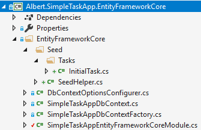
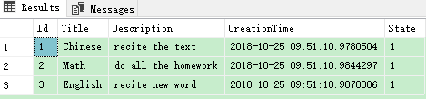
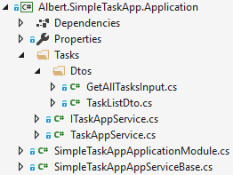
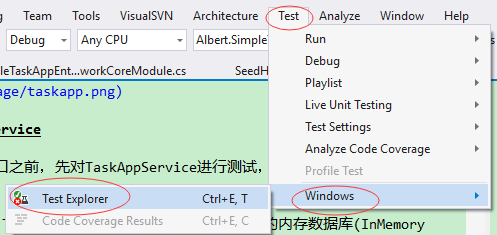
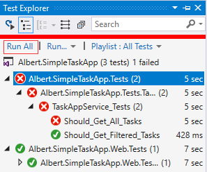
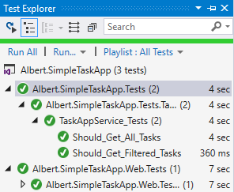
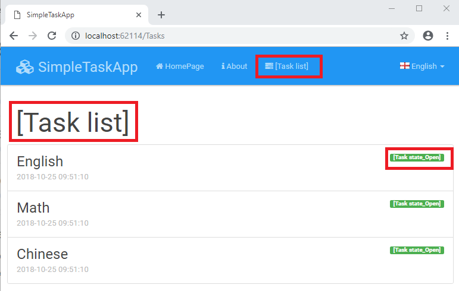
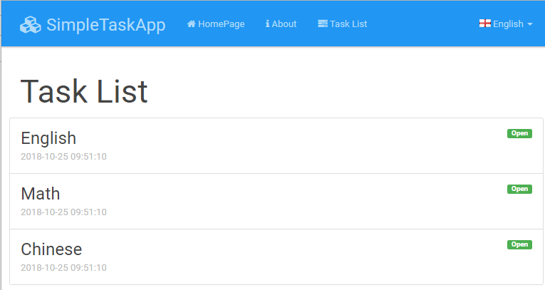

# Albert.SimpleTaskApp

### ASP.NET Core & EntityFramework Core Based Startup Template

This template is a simple startup project to start with ABP
using ASP.NET Core and EntityFramework Core.

#### 项目介绍
ABP官网教程基于AspNet Core + Entity Framework Core 来创建的分层Web应用，在该项目中将会创建一个简单的跨平台分层Web应用，将会使用到下面的相关工具：
* .Net Core 基础跨平台应用开发框架
* [ASP.NET Boilerplate](https://aspnetboilerplate.com) 启动模板和应用框架
* ASP.NET Core Web框架
* Entity Framework Core ORM框架
* Twitter Bootstrap HTML&CSS框架.
* jQuery 客户端 AJAX/DOM 库.
* xUnit and Shouldly 服务端单元测试和集成测试类库.

在ABP启动框架中还包含了 Log4Net 和 AutoMapper 组件，这里将会使用到下面的技术：
* 分层架构
* 领域驱动设计(DDD)
* 依赖注入(DI)
* 集成测试

该项目将会开发一个简单的任务管理应用，实现将任务分配。项目参考[ABP教程官网](https://aspnetboilerplate.com/Pages/Documents/Articles/Introduction-With-AspNet-Core-And-Entity-Framework-Core-Part-1/index.html)。项目源码托管于[码云](https://gitee.com/Mrmantou/Albert.SimpleTaskApp)

#### 准备条件

* Visual Studio 2017
* .NET Core SDK
* SQL Server(or LocalDb)

#### 创建应用

这里使用[ABP的启动模板](https://aspnetboilerplate.com/Templates)进行应用创建，创建一个名为“Albert.SimpleTaskApp”的web应用，这里的“Albert.”在创建应用模板时是选的。本项目是ASP.NET Core的多页面网页应用，同时取消了授权认证，这里只想创建一个最基本的启动模板。


点击“Create my project!”进入项目启动模板下载界面：


下载完成，打开项目解决方案，结构如下所示：


#### 软件架构
解决方案包含了6个项目：
* .Core 项目为领域/业务层(实体，领域服务...)
* .Application 项目为应用层(Dtos，应用服务...)
* .EntityFramework 项目为EF Core集成(从其他层抽象出来的EF Core相关类容)
* .Web 项目为ASP.NET MVC展示层.
* .Tests 项目为单元测试和集成测试(从底层到上层的应用层，不包括Web展示层)
* .Web.Tests 项目为 ASP.NET Core 集成测试 (包括Web展示层的完整集成测试).

#### 启动项目

* 使用 Visual Studio 2017 打开解决方案
* 设置 .Web 项目为启动项目，并编译
* 设置数据库的连接字符串，修改配置文件appsettings.json:
  ```Json
  "ConnectionStrings": {
    "Default": "Server=localhost; Database=SimpleTaskAppDb; Trusted_Connection=True;"
  ```
   本项目使用的为LocalDb，将Server修改为(localdb)\MSSQLLocalDB，修改后的连接为：
  ```Json
  "ConnectionStrings": {
    "Default": "Server=(localdb)\\MSSQLLocalDB; Database=SimpleTaskAppDb; Trusted_Connection=True;"
  ```
* F5启动项目.

启动成功，将会看到项目模板的用户界面：


到此应用程序创建成功。

### 开发应用
#### 创建Task实体

从简单的Task实体开始，实体对象是领域层(Domain)的一部分，向 .Core 项目添加Task实体:
```CSharp
namespace Albert.SimpleTaskApp.Tasks
{
    /// <summary>
    /// 任务
    /// </summary>
    [Table("AppTasks")]
    public class Task : Entity, IHasCreationTime
    {
        /// <summary>
        /// 任务标题
        /// </summary>
        [Required]
        [StringLength(SimpleTaskAppConsts.MaxTitleLength)]
        public string Title { get; set; }

        /// <summary>
        /// 任务描述
        /// </summary>
        [StringLength(SimpleTaskAppConsts.MaxDescriptionLength)]
        public string Description { get; set; }

        /// <summary>
        /// 任务创建时间
        /// </summary>
        public DateTime CreationTime { get; set; }

        /// <summary>
        /// 任务状态
        /// </summary>
        public TaskState State { get; set; }

        public Task()
        {
            CreationTime = Clock.Now;
            State = TaskState.Open;
        }

        public Task(string title, string description = null) : this()
        {
            Title = title;
            Description = description;
        }
    }

    /// <summary>
    /// 任务状态类型
    /// </summary>
    public enum TaskState : byte
    {
        Open = 1,
        Complete = 1
    }
}
```
* 这里Task实体继承了ABP的基类Entity，Entity包含了默认类型为int的属性Id，这里也可以使用泛型`Entity<TPrimaryKey>`，可以设置主键的类型
* `IHasCreationTime` 为简单的接口，只包含了`CreationTime`属性(为`CreationTime`使用标准名称是个好习惯)
* `Task`实体定义了一个必须属性`Title`和一个可选的属性`Description`
* `TaskState`是个定义`Task`状态的简单枚举类型
* `Clock.Now`默认返回`DateTime.Now`。它提供了以个抽象，当需要的时候可以很容易的切换到`DateTime.UtcNow`。在ABP框架中通常使用`Clock.Now`来替换`DateTime.Now`
* 使用注释属性Table表示保存`Task`对象到数据库中的表AppTasks
* 这里使用注释属性来设置Task在数据库中字段的属性，静态类SimpleTaskAppConsts定义了一些常量
  ```csharp
  public class SimpleTaskAppConsts
  {
      public const string LocalizationSourceName = "SimpleTaskApp";

      public const string ConnectionStringName = "Default";

      public const int MaxTitleLength = 256;
      public const int MaxDescriptionLength = 64 * 1024;//64KB
  }
  ```

#### 添加Task到DbContext

.EntityFrameworkCore项目中预定义了`DbContext`，这里需要在里面添加`Task`实体的`DbSet`:
```CSharp
public class SimpleTaskAppDbContext : AbpDbContext
{
    //Add DbSet properties for your entities...
    public DbSet<Task> Tasks { get; set; }

    public SimpleTaskAppDbContex(DbContextOptions<SimpleTaskAppDbContext> options)
        : base(options)
    {

    }
}
```
到此，EF Core就包含了Task实体。

#### 创建第一次数据库迁移

这里创建初始的数据库迁移数据库和表AppTasks。打开**Package Manager Console**，在**Default project** 选择 **.EntityFrameworkCore** 项目(同时还要设置启动项为 .Web 项目，并编译)，执行命令：**add-migration Initial_Task**


执行成功后在 .EntityFrameworkCore 项目中生成 Migrations 文件夹，其中包括了迁移类和数据库快照：


自动生成的`Initial_Task`类：
```csharp
public partial class Initial_Task : Migration
{
    protected override void Up(MigrationBuilder migrationBuilder)
    {
        migrationBuilder.CreateTable(
            name: "AppTasks",
            columns: table => new
            {
                Id = table.Column<int>(nullable: false)
                    .Annotation("SqlServer:ValueGenerationStrategy",SqlServerValueGenerationStrategy.IdentityColumn),
                Title = table.Column<string>(maxLength: 256, nullable: false),
                Description = table.Column<string>(maxLength: 65536, nullable: true),
                CreationTime = table.Column<DateTime>(nullable: false),
                State = table.Column<byte>(nullable: false)
            },
            constraints: table =>
            {
                table.PrimaryKey("PK_AppTasks", x => x.Id);
            });
    }

    protected override void Down(MigrationBuilder migrationBuilder)
    {
        migrationBuilder.DropTable(
            name: "AppTasks");
    }
}
```
这些代码在执行数据库迁移的时候用来创建表**AppTasks**。

#### 创建数据库

在**Package Manager Console**执行命令：update-database


这样将会在数据库实例(本项目使用的是LocalDb)中创建名为SimpleTaskAppDb的数据库(数据库名称在appsettings.json中配置)：


数据库创建成功此时数据库中还没有数据：


下面通过Seed的方式向数据库中添加初始化数据；

在.EntityFrameworkCore项目中添加如图所示的文件夹及类：



静态类SeedHelper提供了seed数据的方法`SeedDb`：
```csharp
public static class SeedHelper
{
    public static void SeedDb(IIocResolver iocResolver)
    {
        WithDbContext<SimpleTaskAppDbContext>(iocResolver, SeedDb);
    }

    private static void SeedDb(SimpleTaskAppDbContext context)
    {
        new InitialTask(context).Create();
    }

    private static void WithDbContext<TDbContext>(IIocResolver iocResolver, Action<TDbContext> contextAction)where TDbContext : DbContext
    {
        using (var uowManager = iocResolver.ResolveAsDisposable<IUnitOfWorkManager>())
        {
            using (var uow = uowManager.Object.Begin(TransactionScopeOption.Suppress))
            {
                var context = uowManager.Object.Current.GetDbContext<TDbContext>();

                contextAction(context);

                uow.Complete();
            }
        }
    }
}
```

```csharp
public class InitialTask
{
    private readonly SimpleTaskAppDbContext context;

    public InitialTask(SimpleTaskAppDbContext context)
    {
        this.context = context;
    }

    public void Create()
    {
        CreateTask();
    }

    private void CreateTask()
    {
        if (context.Tasks.Any())
        {
            return;
        }

        context.AddRange(
            new Task { Title = "Chinese", Description = "recite the text" },
            new Task { Title = "Math", Description = "do all the homework" },
            new Task { Title = "English", Description = "recite new word" }
            );

        context.SaveChanges();
    }
}
```

```csharp
public override void PostInitialize()
{
    SeedHelper.SeedDb(IocManager);
}
```
* WithDbContext方法通过工作单元的方式来调用`SeedDb(SimpleTaskAppDbContext context)`，
* InitialTask类中向数据库插入`Task`对象
* 在SimpleTaskAppEntityFrameworkCore模块的初始化类`SimpleTaskAppEntityFrameworkCoreModule`中重写`PostInitialize`方法，在`PostInitialize`中调用`SeedHelper`的方法向数据库中插入初始数据。

启动项目之后查看数据库：



可以发现初始数据已经插入到数据库中。

#### Task应用服务

应用服务用来向展示层公开领域逻辑。展示层调用应用服务层通过Dto(data transfer object)作为参数(如果需要)，应用层使用领域对象执行特定的业务逻辑并返回Dto对象到展示层(如果需要)。

向.Application项目添加第一个应用服务来处理task相关的应用逻辑，首先定义应用服务接口

```csharp
public interface ITaskAppService
{
    Task<ListResultDto<TaskListDto>> GetAll(GetAllTasksInputinput);
}
```
定义一个接口不是必须的，但是建议这样做。按照惯例，在ABP中所有的应用服务需要实现接口`IApplicationService`(一个起标记作用的空接口)。通过`GetAll`方法类查询tasks，按照前文提到的展示层与应用服务层通过Dto作为数据传输载体，这里需要定义下面的Dto：
```csharp
public class GetAllTasksInput
{
    public TaskState? State { get; set; }
}

[AutoMapFrom(typeof(Task))]
public class TaskListDto : EntityDto, IHasCreationTime
{
    public string Title { get; set; }
    public string Description { get; set; }
    public DateTime CreationTime { get; set; }
    public TaskState State { get; set; }
}
```
* `GetAllTasksInput`定义了GetAll方法的输入参数。相对于直接定义一个方法参数state，这里将其加入到Dto对象中，这样在以后添加其他参数到Dto中的时候不用破坏已有的客户端(这里也可以直接给方法一个state参数)
* `TaskListDto`用来返回Task数据。它继承了`EntityDto`，`EntityDto`只定义了一个Id属性(也可以不继承`EntityDto`直接在Dto中添加Id属性)。使用`[AutoMapFrom]`属性创建从task实体到tasklistdto的自动映射，该属性定义在`Abp.AutoMapper`中
* `ListResultDto`是个简单类，其中包含了一个list类型对象(也可以直接返回`List<TaskListDto>`)

接下来实现`ITaskAppService`.
```csharp
public class TaskAppService : SimpleTaskAppAppServiceBase, ITaskAppService
{
    private readonly IRepository<Task> repository;

    public TaskAppService(IRepository<Task> repository)
    {
        this.repository = repository;
    }

    public async Task<ListResultDto<TaskListDto>> GetAll(GetAllTasksInput input)
    {
        var tasks = await repository.GetAll()
            .WhereIf(input.State.HasValue, t => t.State == input.State)
            .OrderByDescending(t => t.CreationTime)
            .ToListAsync();

        return new ListResultDto<TaskListDto>(ObjectMapper.Map<List<TaskListDto>>(tasks));
    }
}
```
* `TaskAppService`继承于生成的启动模板中的`SimpleTaskAppAppServiceBase`(此类又继承于ABP中的`ApplicationService`)，这不是必须的，应用服务可以是普通的类，只是`ApplicationService`中包括了一些预先注入的服务(比如这里使用的`ObjectMapper`)
* 这里使用了构造函数的依赖注入来获取repository对象
* 仓储对象用来抽象实体对象的数据库操作。ABP为每个实体对象预定义了一个仓储(例如`IRepository<Task>`)来执行通用的任务。`IRepository.GetAll()`用来返回一个`IQueryable`用于查询实体
* `WhereIf`是ABP中的扩展方法，用来简化使用`IQueryable.Where`
  ```csharp
  /// <summary>
  /// Filters a <see cref="IQueryable{T}"/> by given predicate if given condition is true.
  /// </summary>
  /// <param name="query">Queryable to apply filtering</param>
  /// <param name="condition">A boolean value</param>
  /// <param name="predicate">Predicate to filter the query</param>
  /// <returns>Filtered or not filtered query based on <paramref name="condition"/></returns>
  public static IQueryable<T> WhereIf<T>(this IQueryable<T> query, bool condition,Expression<Func<T, bool>> predicate)
  {
      return condition
          ? query.Where(predicate)
          : query;
  }
  ```
* `ObjectMapper`(来自`ApplicationService`基类，默认通过AutoMapper来实现)用于Task对象集合到TaskListDto对象集合的映射

添加Task应用服务的代码结构：



#### 测试TaskAppService

在进一步创建用户接口之前，先对TaskAppService进行测试，如果对自动化测试不感兴趣可以跳过这一节。

启动模板包括了一个.Tests项目用于测试代码。使用EF Core的内存数据库(InMemory database)替换SQL server。这样单元测试可以脱离真实的数据库进行工作。它可以针对每个测试创建一个单独的数据库，是的各个测试之间是隔离的。这里可以在运行测试之前使用`TestDataBuilder`类向内存数据库中添加一些测试数据
```csharp
public class TestDataBuilder
{
    private readonly SimpleTaskAppDbContext _context;

    public TestDataBuilder(SimpleTaskAppDbContext context)
    {
        _context = context;
    }

    public void Build()
    {
        //create test data here...
        _context.Tasks.AddRange(
            new Task("Follow the white rabbit", "Follow the white rabbit in order to know the reality."),
            new Task("Clean your room") { State = TaskState.Completed }
            );
    }
}
```

可以在ABP示例项目中查看`TestDataBuilder`的使用方法，在这里添加了两个task到dbcontext中，这样可以编写单元测试断言数据库中的task对象个数为2.下面将对前面的`TaskAppService.GetAll`方法进行测试：
```csharp
public class TaskAppService_Tests : SimpleTaskAppTestBase
{
    private readonly ITaskAppService taskAppService;

    public TaskAppService_Tests()
    {
        taskAppService = Resolve<ITaskAppService>();
    }

    [Fact]
    public async System.Threading.Tasks.Task Should_Get_All_Tasks()
    {
        //Act
        var output = await taskAppService.GetAll(new GetAllTasksInput());

        //Assert
        output.Items.Count.ShouldBe(2);
    }

    [Fact]
    public async System.Threading.Tasks.Task Should_Get_Filtered_Tasks()
    {
        //Act
        var output = await taskAppService.GetAll(
            new GetAllTasksInput() { State = TaskState.Open });

        //Assert
        output.Items.ShouldAllBe(t => t.State == TaskState.Open);
    }
}
```

这里编写了GetAll方法的两中不同情景的测试，打开Test Explorer：



运行单元测试，发现出现错误了：



在output窗口查看输出信息：
```
[10/25/2018 3:20:50 PM Error] [xUnit.net 00:00:06.93]     Albert.SimpleTaskApp.Tests.Tasks.TaskAppService_Tests.Should_Get_All_Tasks [FAIL]
[10/25/2018 3:20:50 PM Informational] [xUnit.net 00:00:06.94]       Shouldly.ShouldAssertException : output.Items.Count
    should be
2
    but was
[10/25/2018 3:20:50 PM Informational] [xUnit.net 00:00:06.94]       5
```
在错误信息中可以看出Should_Get_All_Tasks出错，期待的结果为2，但是实际的是5，说明数据库查到了5条数据，在TestDataBuilder明明添加的只有两条数据，这里变成5条，问题出现在哪里呢？可以debug单元测试，查看数据内容，这里的问题出在前面通过Seed的方式向数据库中添加了3条数据，在单元测试中并需要Seed的数据，那么需要对前面的代码进行调整，在`SimpleTaskAppEntityFrameworkCoreModule`中添加属性SkipDbSeed来控制是否向数据库中Seed初始化数据，该属性默认为false
```csharp
/// <summary>
/// 单元测试中跳过向数据库中添加初始化数据，测试数据在单元测试中由TestDataBuilder添加
/// </summary>
public bool SkipDbSeed { get; set; }
```
并修改PostInitialize方法：
```csharp
public override void PostInitialize()
{
    if (!SkipDbSeed)
    {
        SeedHelper.SeedDb(IocManager);
    }
}
```
这样就可以通过SkipDbSeed来控制是否向数据库中Seed初始化数据。在单元测试中需要跳过Seed数据，将SkipDbSeed置为true，在`SimpleTaskAppTestModule`中添加构造函数，并通过构造函数注入`SimpleTaskAppEntityFrameworkCoreModule`对象，添加的代码如下所示：
```csharp
public SimpleTaskAppTestModule(SimpleTaskAppEntityFrameworkCoreModule appEntityFrameworkCoreModule)
{
    appEntityFrameworkCoreModule.SkipDbSeed = true;
}
```
重新编译运行单元测试：



可以看见单元测试全部通过，最后一个单元测试是由启动模板创建的，可以暂时忽略。

**需要注意的是：** ABP模板已经自动添加了xUnit和Shouldly的nuget包，这样就可以直接在单元测试中使用它们。

#### Task列表视图

##### 添加一个新的菜单项

在.Web项目中导航配置类`SimpleTaskAppNavigationProvider`中添加新的菜单选项：
```csharp
public override void SetNavigation(INavigationProviderContext context)
{
    context.Manager.MainMenu
        .AddItem(
            new MenuItemDefinition(
                PageNames.Home,
                L("HomePage"),
                url: "",
                icon: "fa fa-home"
                )
        ).AddItem(
            new MenuItemDefinition(
                PageNames.About,
                L("About"),
                url: "Home/About",
                icon: "fa fa-info"
                )
        ).AddItem(
            new MenuItemDefinition(
                PageNames.Task,
                L("TaskList"),
                url: "Tasks",
                icon: "fa fa-tasks")
        );
}
```
* 上面的代码可以看出启动模板项目中包含两个页面：主页(Home)和关于(About)，这里可以修改它们或者新增一个页面，这里先保留这两个页面添加了一个新的菜单选项
* PageNames中定义了页面名称相关常量
  ```csharp
  public class PageNames
  {
      public const string Home = "Home";
      public const string About = "About";
      public const string Task = "Task List";
  }
  ```
  这里也可以不定义常量，直接填写字符串"Task List"

#### 创建TaskController 和 ViewModel

在.Web项目中添加一个新的控制器类`TasksController`，内容如下所示：
```csharp
public class TasksController : SimpleTaskAppControllerBase
{
    private readonly ITaskAppService taskAppService;

    public TasksController(ITaskAppService taskAppService)
    {
        this.taskAppService = taskAppService;
    }

    public async Task<IActionResult> Index(GetAllTasksInput input)
    {
        var output = await taskAppService.GetAll(input);

        var model = new IndexViewModel(output.Items);

        return View(model);
    }
}
```
* TasksController继承了SimpleTaskAppControllerBase(该类又继承了AbpController)，该基类包含了这个项目中控制器通用的代码
* 注入了`ITaskAppService`来获取task列表
* 为了避免直接将GetAll方法的结果传递给视图，这里创建了`IndexViewModel`类：
```csharp
public class IndexViewModel
{
    public IReadOnlyList<TaskListDto> Tasks { get; set; }

    public IndexViewModel(IReadOnlyList<TaskListDto> tasks)
    {
        Tasks = tasks;
    }

    public string GetTaskLabel(TaskListDto task)
    {
        switch (task.State)
        {
            case TaskState.Open:
                return "label-success";
            default:
                return "label-default";
        }
    }
}
```
这个简单的视图模型通过构造函数获取一个task的列表(通过ITaskAppService获取到)。还包含了一个方法GetTaskLabel用来进行Bootstrap标签的转换(显示任务状态的图标)

#### 任务列表页面

给控制器的Index方法添加视图，修改Index视图如下：
```html
@using Albert.SimpleTaskApp.Web.Startup
@model Albert.SimpleTaskApp.Web.Models.Tasks.IndexViewModel

@{
    ViewBag.Title = L("TaskList");
    ViewBag.ActiveMenu = "TaskList"; //Matches with the menu name in SimpleTaskAppNavigationProvider to highlight the menu item
}

<h2>@L("TaskList")</h2>

<div class="row">
    <div>
        <ul class="list-group" id="TaskList">
            @foreach(var task in Model.Tasks)
            {
                <li class="list-group-item">
                    <span class="pull-right label @Model.GetTaskLabel(task)">@L($"TaskState_{task.State}")</span>
                    <h4 class="list-group-item-heading">@task.Title</h4>
                    <div class="list-group-item-text">
                        @task.CreationTime.ToString("yyyy-MM-dd HH:mm:ss")
                    </div>
                </li>
            }
        </ul>
    </div>
</div>
```
这里只是使用给定的模型通过Bootstrap的list group组件呈现视图，使用了`IndexViewModel.GetTaskLabel()`方法来获取task的标签类型，呈现结果如下：



在界面上导航菜单的名称、页面标题和任务的状态显示的为[xxx]，是因为这里调用了ABP框架中的L方法来本地化字符串。根据不同的语言获取对应的字符串。语言配置在.Core项目下的Localization/Source文件夹中的json格式文件中，添加该项目中调用L方法时传入参数对应的配置：
```
{
  "culture": "en",
  "texts": {
    "HelloWorld": "Hello World!",
    "ChangeLanguage": "Change language",
    "HomePage": "HomePage",
    "About": "About",
    "Home_Description": "Welcome to SimpleTaskApp...",
    "About_Description": "This is a simple startup template to use ASP.NET Core with ABP framework.",
    "TaskList": "Task List",
    "TaskState_Open": "Open",
    "TaskState_Completed": "Completed"
  }
}
```
根据程序当前状态添加了最后三行的配置，重新启动项目可以看见显示正常：



使用ABP进行语言本地化很简单，可以通过[ABP官方教程](https://aspnetboilerplate.com/Pages/Documents/Localization)获取更过关于系统本地化的相关信息
