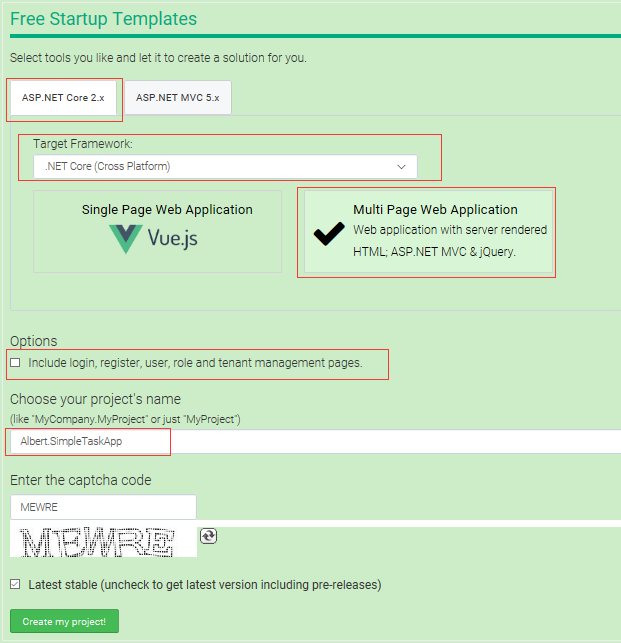
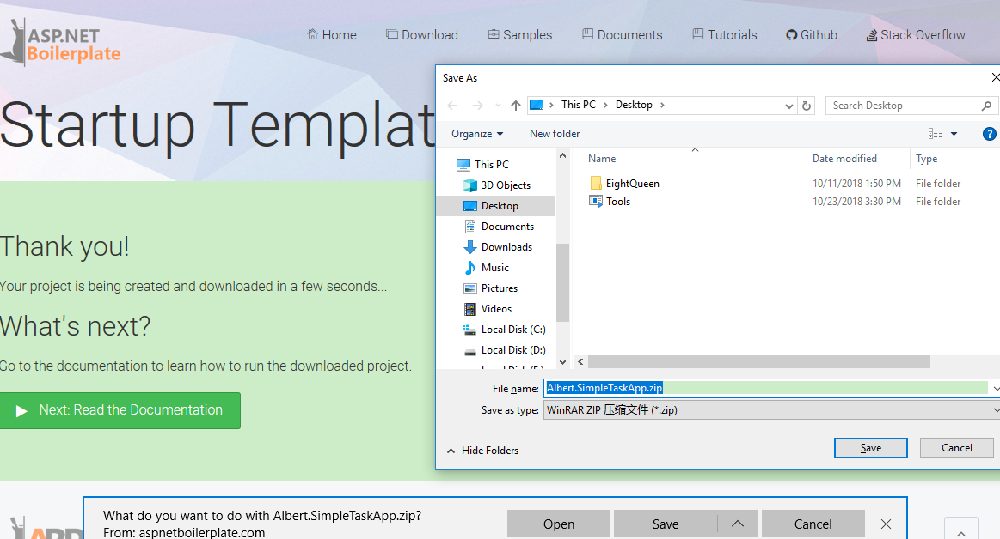
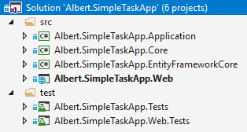
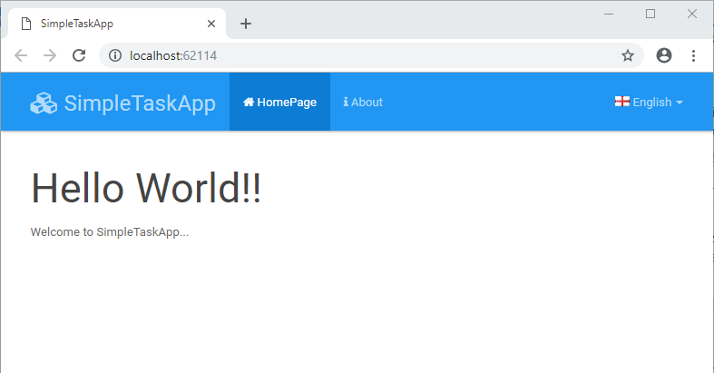
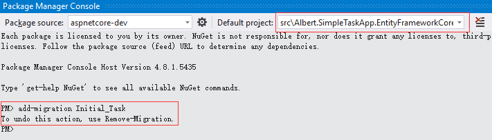
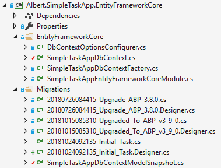
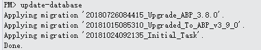
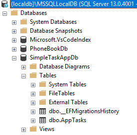
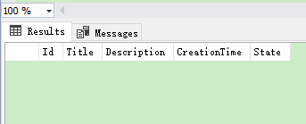

# Albert.SimpleTaskApp

### ASP.NET Core & EntityFramework Core Based Startup Template

This template is a simple startup project to start with ABP
using ASP.NET Core and EntityFramework Core.

#### 项目介绍
ABP官网教程基于AspNet Core + Entity Framework Core 来创建的分层Web应用，在该项目中将会创建一个简单的跨平台分层Web应用，将会使用到下面的相关工具：
* .Net Core 基础跨平台应用开发框架
* [ASP.NET Boilerplate](https://aspnetboilerplate.com) 启动模板和应用框架
* ASP.NET Core Web框架
* Entity Framework Core ORM框架
* Twitter Bootstrap HTML&CSS框架.
* jQuery 客户端 AJAX/DOM 库.
* xUnit and Shouldly 服务端单元测试和集成测试类库.

在ABP启动框架中还包含了 Log4Net 和 AutoMapper 组件，这里将会使用到下面的技术：
* 分层架构
* 领域驱动设计(DDD)
* 依赖注入(DI)
* 集成测试

该项目将会开发一个简单的任务管理应用，实现将任务分配。项目参考[ABP教程官网](https://aspnetboilerplate.com/Pages/Documents/Articles/Introduction-With-AspNet-Core-And-Entity-Framework-Core-Part-1/index.html)。项目源码托管于[码云](https://gitee.com/Mrmantou/Albert.SimpleTaskApp)

#### 准备条件

* Visual Studio 2017
* .NET Core SDK
* SQL Server(or LocalDb)

#### 创建应用

这里使用[ABP的启动模板](https://aspnetboilerplate.com/Templates)进行应用创建，创建一个名为“Albert.SimpleTaskApp”的web应用，这里的“Albert.”在创建应用模板时是选的。本项目是ASP.NET Core的多页面网页应用，同时取消了授权认证，这里只想创建一个最基本的启动模板。



点击“Create my project!”进入项目启动模板下载界面：



下载完成，打开项目解决方案，结构如下所示：



#### 软件架构
解决方案包含了6个项目：
* .Core 项目为领域/业务层(实体，领域服务...)
* .Application 项目为应用层(Dtos，应用服务...)
* .EntityFramework 项目为EF Core集成(从其他层抽象出来的EF Core相关类容)
* .Web 项目为ASP.NET MVC展示层.
* .Tests 项目为单元测试和集成测试(从底层到上层的应用层，不包括Web展示层)
* .Web.Tests 项目为 ASP.NET Core 集成测试 (包括Web展示层的完整集成测试).

#### 启动项目

* 使用 Visual Studio 2017 打开解决方案
* 设置 .Web 项目为启动项目，并编译
* 设置数据库的连接字符串，修改配置文件appsettings.json:
  ```Json
  "ConnectionStrings": {
    "Default": "Server=localhost; Database=SimpleTaskAppDb; Trusted_Connection=True;"
  ```
   本项目使用的为LocalDb，将Server修改为(localdb)\MSSQLLocalDB，修改后的连接为：
  ```Json
  "ConnectionStrings": {
    "Default": "Server=(localdb)\MSSQLLocalDB; Database=SimpleTaskAppDb; Trusted_Connection=True;"
    ```
* F5启动项目.

启动成功，将会看到项目模板的用户界面：



到此应用程序创建成功。

### 开发应用
#### 创建Task实体

从简单的Task实体开始，实体对象是领域层(Domain)的一部分，向 .Core 项目添加Task实体:
```CSharp
namespace Albert.SimpleTaskApp.Tasks
{
    /// <summary>
    /// 任务
    /// </summary>
    [Table("AppTasks")]
    public class Task : Entity, IHasCreationTime
    {
        /// <summary>
        /// 任务标题
        /// </summary>
        [Required]
        [StringLength(SimpleTaskAppConsts.MaxTitleLength)]
        public string Title { get; set; }

        /// <summary>
        /// 任务描述
        /// </summary>
        [StringLength(SimpleTaskAppConsts.MaxDescriptionLength)]
        public string Description { get; set; }

        /// <summary>
        /// 任务创建时间
        /// </summary>
        public DateTime CreationTime { get; set; }

        /// <summary>
        /// 任务状态
        /// </summary>
        public TaskState State { get; set; }

        public Task()
        {
            CreationTime = Clock.Now;
            State = TaskState.Open;
        }

        public Task(string title, string description = null) : this()
        {
            Title = title;
            Description = description;
        }
    }

    /// <summary>
    /// 任务状态类型
    /// </summary>
    public enum TaskState : byte
    {
        Open = 1,
        Complete = 1
    }
}
```
* 这里Task实体继承了ABP的基类Entity，Entity包含了默认类型为int的属性Id，这里也可以使用泛型`Entity<TPrimaryKey>`，可以设置主键的类型
* `IHasCreationTime` 为简单的接口，只包含了`CreationTime`属性(为`CreationTime`使用标准名称是个好习惯)
* `Task`实体定义了一个必须属性`Title`和一个可选的属性`Description`
* `TaskState`是个定义`Task`状态的简单枚举类型
* `Clock.Now`默认返回`DateTime.Now`。它提供了以个抽象，当需要的时候可以很容易的切换到`DateTime.UtcNow`。在ABP框架中通常使用`Clock.Now`来替换`DateTime.Now`
* 使用注释属性Table表示保存`Task`对象到数据库中的表AppTasks
* 这里使用注释属性来设置Task在数据库中字段的属性，静态类SimpleTaskAppConsts定义了一下常量

#### 添加Task到DbContext

.EntityFrameworkCore项目中预定义了`DbContext`，这里需要在里面添加`Task`实体的`DbSet`:
```CSharp
public class SimpleTaskAppDbContext : AbpDbContext
{
    //Add DbSet properties for your entities...
    public DbSet<Task> Tasks { get; set; }

    public SimpleTaskAppDbContex(DbContextOptions<SimpleTaskAppDbContext> options)
        : base(options)
    {

    }
}
```
到此，EF Core就包含了Task实体。

#### 创建第一次数据库迁移

这里创建初始的数据库迁移数据库和表AppTasks。打开**Package Manager Console**，在**Default project** 选择 **.EntityFrameworkCore** 项目(同时还要设置启动项为 .Web 项目，并编译)，执行命令：**add-migration Initial_Task**



执行成功后在 .EntityFrameworkCore 项目中生成 Migrations 文件夹，其中包括了迁移类和数据库快照：



自动生成的`Initial_Task`类：
```csharp
public partial class Initial_Task : Migration
{
    protected override void Up(MigrationBuilder migrationBuilder)
    {
        migrationBuilder.CreateTable(
            name: "AppTasks",
            columns: table => new
            {
                Id = table.Column<int>(nullable: false)
                    .Annotation("SqlServer:ValueGenerationStrategy",SqlServerValueGenerationStrategy.IdentityColumn),
                Title = table.Column<string>(maxLength: 256, nullable: false),
                Description = table.Column<string>(maxLength: 65536, nullable: true),
                CreationTime = table.Column<DateTime>(nullable: false),
                State = table.Column<byte>(nullable: false)
            },
            constraints: table =>
            {
                table.PrimaryKey("PK_AppTasks", x => x.Id);
            });
    }

    protected override void Down(MigrationBuilder migrationBuilder)
    {
        migrationBuilder.DropTable(
            name: "AppTasks");
    }
}
```
这些代码在执行数据库迁移的时候用来创建表**AppTasks**。

#### 创建数据库

在**Package Manager Console**执行命令：update-database



这样将会在数据库实例(本项目使用的是LocalDb)中创建名为SimpleTaskAppDb的数据库(数据库名称在appsettings.json中配置)：



数据库创建成功此时数据库中还没有数据：



下面通过Seed的方式向数据库中添加初始化数据

#### 码云特技

1. 使用 Readme\_XXX.md 来支持不同的语言，例如 Readme\_en.md, Readme\_zh.md
2. 码云官方博客 [blog.gitee.com](https://blog.gitee.com)
3. 你可以 [https://gitee.com/explore](https://gitee.com/explore) 这个地址来了解码云上的优秀开源项目
4. [GVP](https://gitee.com/gvp) 全称是码云最有价值开源项目，是码云综合评定出的优秀开源项目
5. 码云官方提供的使用手册 [https://gitee.com/help](https://gitee.com/help)
6. 码云封面人物是一档用来展示码云会员风采的栏目 [https://gitee.com/gitee-stars/](https://gitee.com/gitee-stars/)