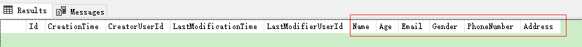

#### 创建People展示页面

到目前为止Person实体中只包含了Name一个描述属性，这里先给Person实体添加几个属性：
```csharp
[Table("AppPersons")]
public class Person : AuditedEntity<Guid>
{
    [Required]
    [StringLength(SimpleTaskAppConsts.MaxNameLength)]
    public string Name { get; set; }

    [StringLength(SimpleTaskAppConsts.MaxPhoneNumberLength)]
    public string PhoneNumber { get; set; }

    public int? Age { get; set; }

    public char? Gender { get; set; }

    [EmailAddress]
    public string Email { get; set; }

    [StringLength(SimpleTaskAppConsts.MaxAddressLength)]
    public string Address { get; set; }

    public Person() { }

    public Person(string name)
    {
        Name = name;
    }
}
```
接下来迁移变化到数据库：
```
PM> add-migration "add_Person_proterty"
To undo this action, use Remove-Migration.
PM> update-database
```
查看数据库可以看到数据库添加了新的字段


#### 