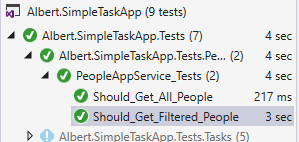
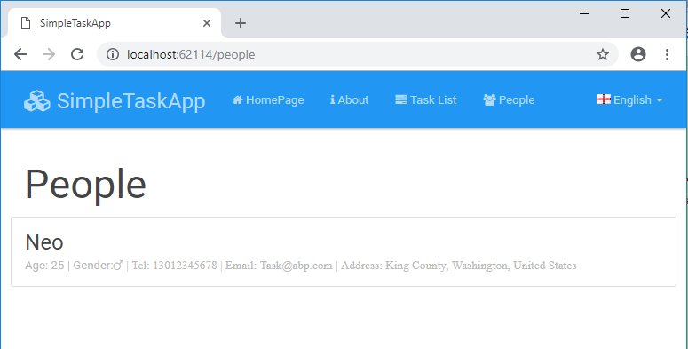
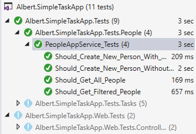
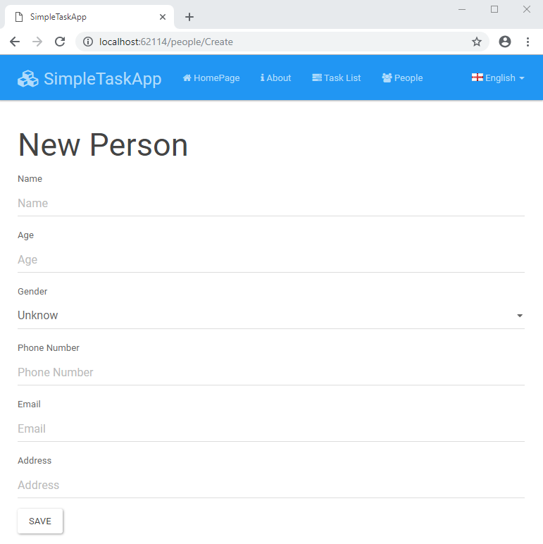

#### 创建People展示页面

到目前为止Person实体中只包含了Name一个描述属性，这里先给Person实体添加几个属性：
```csharp
[Table("AppPersons")]
public class Person : AuditedEntity<Guid>
{
    [Required]
    [StringLength(SimpleTaskAppConsts.MaxNameLength)]
    public string Name { get; set; }

    [StringLength(SimpleTaskAppConsts.MaxPhoneNumberLength)]
    public string PhoneNumber { get; set; }

    public int? Age { get; set; }

    public char? Gender { get; set; }

    [EmailAddress]
    public string Email { get; set; }

    [StringLength(SimpleTaskAppConsts.MaxAddressLength)]
    public string Address { get; set; }

    public Person() { }

    public Person(string name)
    {
        Name = name;
    }
}
```
接下来迁移变化到数据库：
```
PM> add-migration "add_Person_proterty"
To undo this action, use Remove-Migration.
PM> update-database
```
查看数据库可以看到数据库添加了新的字段：


#### 应用层查询所有的People信息

在应用服务层中`PersonAppService`中添加查询所有peoson信息的接口及方法：
```csharp
public interface IPersonAppService
{
    //...
    Task<ListResultDto<PersonListDto>> GetAl(GetAllPeopleInput input);
}

public class PersonAppService : SimpleTaskAppAppServiceBase, IPersonAppService
{
    //...
    public async Task<ListResultDto<PersonListDto>> GetAll(GetAllPeopleInput input)
    {
        var people = await repository.GetAll()
              .WhereIf(!string.IsNullOrEmpty(input.Name), p => p.Name == input.Name)
              .OrderBy(p => p.Name)
              .ToListAsync();

        return new ListResultDto<PersonListDto>(ObjectMapper.Map<List<PersonListDto>>(people));
    }
}
```
其中的入参和返回参数分别为：
```csharp
public class GetAllPeopleInput
{
    public string Name { get; set; }
}

[AutoMapFrom(typeof(Person))]
public class PersonListDto
{
    public string Name { get; set; }

    public string PhoneNumber { get; set; }

    public int? Age { get; set; }

    public char? Gender { get; set; }

    public string Email { get; set; }

    public string Address { get; set; }
}
```

#### 测试上面的查询方法

在.Tests项目中添加PeopleAppService的测试类，并添加两个方法从数据库中查询数据：
```csharp
public class PeopleAppService_Tests : SimpleTaskAppTestBase
{
    private readonly IPersonAppService personAppService;

    public PeopleAppService_Tests()
    {
        personAppService = Resolve<IPersonAppService>();
    }

    [Fact]
    public async Task Should_Get_All_People()
    {
        var output = await personAppService.GetAll(new GetAllPeopleInput());

        output.Items.Count.ShouldBe(2);
    }

    [Fact]
    public async Task Should_Get_Filtered_People()
    {
        var output = await personAppService.GetAll(new GetAllPeopleInput() { Name="Athy" });

        output.Items.Count.ShouldBe(1);
        output.Items.ShouldAllBe(p => p.Name == "Athy");
    }
}
```
这里为了测试效果在初始数据中又添加了一条person数据Athy：
```csharp
public void Build()
{
    //create test data here...
    var neo = new Person("Neo");
    var athy = new Person("Athy");
    _context.People.Add(neo);
    _context.People.Add(athy);
    //...
}
```
运行单元测试全部通过。



#### 添加Person控制器

创建控制器`PeopleController`:
```csharp
public class PeopleController : SimpleTaskAppControllerBase
{
    private readonly IPersonAppService personAppService;

    public PeopleController(IPersonAppService personAppService)
    {
        this.personAppService = personAppService;
    }

    public async Task<IActionResult> Index(GetAllPeopleInput input)
    {
        var output = await personAppService.GetAll(input);

        var model = new PeopleIndexViewModel(output.Items);

        return View(model);
    }
}
```
其中`PeopleIndexViewModel`为：
```csharp
public class PeopleIndexViewModel
{
    public IReadOnlyList<PersonListDto> People { get;set; }

    public PeopleIndexViewMode(IReadOnlyList<PersonListDto> people)
    {
        People = people;
    }
}
```

#### 创建People视图

添加Index视图:
```html
@model Albert.SimpleTaskApp.Web.Models.People.PeopleIndexViewModel

@{
    ViewBag.Title = L("People");
    ViewBag.ActiveMenu = "People"; //Matches with the menu name in SimpleTaskAppNavigationProvider to highlight the menu item
}

<h2>@L("People")</h2>

<div class="row">
    <div>
        <ul class="list-group" id="People">
            @foreach (var person in Model.People)
            {
                <li class="list-group-item">
                    <h4 class="list-group-item-heading">@person.Name</h4>
                    <div class="list-group-item-text">
                        Age: @person.Age | Gender:<span class="@Model.GetPersonGender(person.Gender)" /> | Tel: @person.PhoneNumber | Email: @person.Email | Address: @person.Address
                    </div>
                </li>
            }
        </ul>
    </div>
</div>
```
在首页添加People导航，在SimpleTaskAppNavigationProvider中添加：
```csharp
public override void SetNavigation(INavigationProviderContext context)
{
    context.Manager.MainMenu
        //...
        ).AddItem(
            new MenuItemDefinition(
                PageNames.People,
                L("People"),
                url: "people",
                icon: "fa fa-users")
        );
}
```
添加页面名称：
```csharp
public class PageNames
{
    //...
    public const string People = "People";
}
```
本地化添加配置：
```json
"People": "People"
```
在数据库People表中存入一条数据，启动:



可以看见person信息已经全部展示在页面上。

#### 创建Person保存到数据库

首先在应用服务层添加创建实体的服务接口及方法：
```csharp
public interface IPersonAppService
{
    //...
    Task Create(CreatePersonInput input);
}

public class PersonAppService : SimpleTaskAppAppServiceBase, IPersonAppService
{
    //...
    public async Task Create(CreatePersonInput input)
    {
        var person = ObjectMapper.Map<Person>(input);

        await repository.InsertAsync(person);
    }
}
```

这里的CreatePersonInput页面传进的参数：
```csharp
[AutoMapTo(typeof(Person))]
public class CreatePersonInput
{
    [Required]
    [StringLength(SimpleTaskAppConsts.MaxNameLength)]
    public string Name { get; set; }

    [StringLength(SimpleTaskAppConsts.MaxPhoneNumberLength)]
    public string PhoneNumber { get; set; }

    public int? Age { get; set; }

    public Genter? Gender { get; set; }

    [EmailAddress]
    public string Email { get; set; }

    [StringLength(SimpleTaskAppConsts.MaxAddressLength)]
    public string Address { get; set; }
}
```

#### 单元测试应用服务层方法

编写单元测试：
```csharp
public class PeopleAppService_Tests : SimpleTaskAppTestBase
{
    //...
    [Fact]
    public async Task Should_Create_New_Person_With_Name()
    {
        await personAppService.Create(new CreatePersonInput
        {
            Name = "li"
        });

        UsingDbContext(context =>
        {
            var person1 = context.People.FirstOrDefault(p => p.Name == "li");
            person1.ShouldNotBeNull();
        });
    }

    [Fact]
    public async Task Should_Create_New_Person_Without_Name()
    {
        await Assert.ThrowsAsync<AbpValidationException>(async () =>
        {
            await personAppService.Create(new CreatePersonInput
            {
                Name = null
            });
        });
    }
}
```
上面两个测试方法通过CreatePersonInput对象传递person信息，由于Person->Name属性是必须的类型，所以在Name为Null的情形下抛出异常。运行单元测试通过。



#### 创建Person页面

在People控制器添加Create方法：
```csharp
 public class PeopleController : SimpleTaskAppControllerBase
{
    //...
    public IActionResult Create()
    {
        return View(new CreatePersonViewModel());
    }
}
```
Create方法返回的view带有ViewModel->CreatePersonViewModel:
```csharp
public class CreatePersonViewModel
{
    public List<SelectListItem> Genders { get; set; }

    public CreatePersonViewModel()
    {
        Genders = InitGender();
    }

    private List<SelectListItem> InitGender()
    {
        var genderList = EnumHelper.GetSelectList<Genter>();

        genderList.Insert(0, new SelectListItem { Text = "Unknow", Value =null });

        return genderList;
    }
}
```
这里的Genders供界面的Gender选项的Combobox使用，使用了EnumHelper类：
```csharp
namespace Albert.SimpleTaskApp.Web.Utils
{
    public class EnumHelper
    {
        public static List<SelectListItem> GetSelectList<T>()
        {
            var enumType = typeof(T);
            List<SelectListItem> selectList = new List<SelectListItem>();

            foreach (var value in Enum.GetValues(enumType))
            {
                selectList.Add(new SelectListItem
                {
                    Text = Enum.GetName(enumType, value),
                    Value = value.ToString()
                });
            }

            return selectList;
        }
    }
}
```
创建Create页面：
```html
@model Albert.SimpleTaskApp.Web.Models.People.CreatePersonViewModel

<h2>@L("NewPerson")</h2>

@section scripts
    {
    <environment names="Development">
        <script src="~/js/views/people/create.js"></script>
    </environment>

    <environment names="Staging,Production">
        <script src="~/js/views/people/create.min.js"></script>
    </environment>
}

<form id="PersonCreationForm">
    <div class="form-group">
        <label for="Name">@L("Name")</label>
        <input type="text" name="Name" class="form-control" placeholder="@L("Name")" required maxlength="@Albert.SimpleTaskApp.SimpleTaskAppConsts.MaxNameLength" />
    </div>

    <div class="form-group">
        <label for="Age">@L("Age")</label>
        <input type="number" name="Age" class="form-control" placeholder="@L("Age")" />
    </div>

    <div class="form-group">
        @Html.Label(L("Gender"))
        @Html.DropDownList("Gender", Model.Genders, new { @class = "form-control", id = "GenderCombobox" })
    </div>

    <div class="form-group">
        <label for="PhoneNumber">@L("PhoneNumber")</label>
        <input type="tel" name="PhoneNumber" class="form-control" placeholder="@L("PhoneNumber")" maxlength="@Albert.SimpleTaskApp.SimpleTaskAppConsts.MaxPhoneNumberLength" />
    </div>

    <div class="form-group">
        <label for="Email">@L("Email")</label>
        <input type="email" name="Email" class="form-control" placeholder="@L("Email")" required />
    </div>

    <div class="form-group">
        <label for="Address">@L("Address")</label>
        <input type="text" name="Address" class="form-control" placeholder="@L("Address")" maxlength="@Albert.SimpleTaskApp.SimpleTaskAppConsts.MaxAddressLength" />
    </div>

    <button type="submit" class="btn btn-default">@L("Save")</button>
</form>
```
同时在Index页面添加创建Person的导航：
```html
<h2>
    @L("People")
    <span><a class="btn btn-primary btn-sm" asp-action="Create">@L("AddNew")</a></span>
</h2>
```
添加本地化配置：
```json
"NewPerson": "New Person",
"People": "People",
"Name": "Name",
"Age": "Age",
"Gender": "Gender",
"PhoneNumber": "Phone Number",
"Email": "Email",
"Address": "Address"
```

启动，在People展示页面可以看见新添加的Add New按钮，点击按钮进入Person创建页面：



但是点击Save按钮还没有任何的作用，下面添加js来实现save效果，在.Web\wwwroot\js\views\people下添加create.js：
```js
(function ($) {
    $(function () {
        var _$form = $('#PersonCreationForm');

        _$form.find('input:first').focus();

        _$form.validate();

        _$form.find('button[type=submit]')
            .click(function (e) {
                e.preventDefault();

                if (!_$form.valid()) {
                    return;
                }

                var input = _$form.serializeFormToObject();

                abp.services.app.person.create(input)
                    .done(function () {
                        location.href = '/People';
                    });
            });
    });
})(jQuery);
```
使用Minifier进行压缩，添加到create页面：
```html
@section scripts
    {
    <environment names="Development">
        <script src="~/js/views/people/create.js"></script>
    </environment>

    <environment names="Staging,Production">
        <script src="~/js/views/people/create.min.js"></script>
    </environment>
}
```

运行程序，填写信息点击保存可以成功保存数据，同时在返回的People页面显示出了新添加的数据。至此，Person的查询展示和创建功能已全部实现。